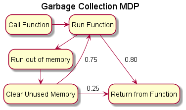

# SWEN-711: Homework 4
For homework 4

# Question One
## Environment Dynamics
1. p = 0.8
    * The correct action is attempted
1. p = 0.05
    * The agent is confused and moves +90&deg;
1. p = 0.05
    * The agent is confused and moves -90&deg;
1. p = 0.1
    * The agent is confused and does not move

## Assumptions
1. The agent cannot move out of the world, an attempt to do so will result in no movement

## Part 1
See [P1.py](src/P1.py) for the python code related to part 1. Because of the above Environment Dynamics there is some variablility but a sample statistical analysis of the observed discounted returns is below:
```
Mean:  -25.838
Standard Deviation:  49.91129888111509
Maximum:  10
Minimuim:  -490
```

## Part 2
see [P2.py](src/P2.py) for the python code related to Part 2. Below is the world in which the maximum future discounted rewards are displayed. Note that this was found using the Value Iteration method and iterated until the values changes were less than 0.05, which took 14 iterations. Also note that the xxx.xxx spaces represent the obstacles (states that cannot be entered).
```
[+003.74] [+004.24] [+004.79] [+005.40] [+005.96]
[+004.06] [+004.67] [+005.37] [+006.13] [+006.79]
[+003.59] [+004.08] [xxx.xxx] [+006.95] [+007.73]
[+003.16] [+003.56] [xxx.xxx] [+007.82] [+008.79]
[+002.72] [+002.43] [-010.00] [+008.79] [+010.00]
```

For the purposes of viewing it prettily, the below uses the same values and shows the appropriate action to take in each state. Note that '█' spaces are obstacles and '+' is the goal
```
[ → ][ → ][ → ][ ↓ ][ ↓ ]
[ → ][ → ][ → ][ ↓ ][ ↓ ]
[ → ][ ↑ ][ █ ][ ↓ ][ ↓ ]
[ ↑ ][ ↑ ][ █ ][ → ][ ↓ ]
[ ↑ ][ ↑ ][ → ][ → ][ + ]
```

## Part 3
see [P3.py](src/P3.py) for the python code related to Part 3. Similarly to Part 1, except using the above policy, it was run 10,000 times and some statistics are shown below.
```
Mean:  10.0
Standard Deviation:  0.0
Maximum:  10.0
Minimuim:  10.0
```
We can see a 100% success rate, to really put it to the test I even ran it for 1 million times, and I still got the same answer.


# Question 2
